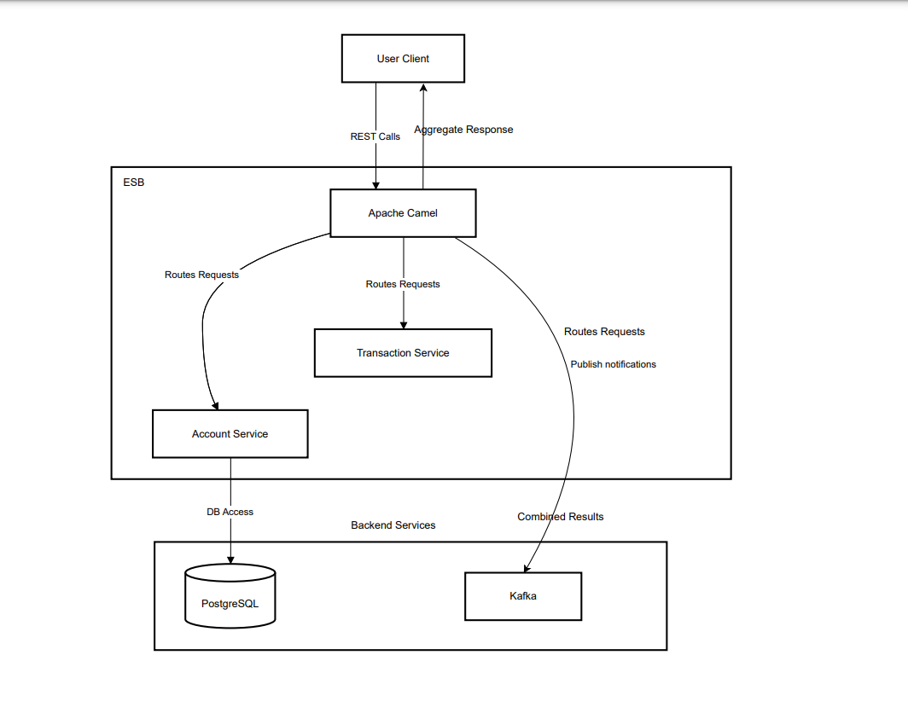

## Overview

This project provides a simplistic example demonstrating how to integrate various banking services using different data formats such as XML and JSON. The goal is to make it easier for users to work with more modern and widely-used formats like JSON, while still supporting legacy systems using XML. This example highlights how Apache Camel can streamline service integration and help transition to more efficient data formats.

## Features
- **Balance Inquiry**: Retrieve the balance for a given account.
- **Transaction History**: Retrieve a list of transactions for a given account.
- **Large Transaction Notifications**: Sends email and Kafka notifications when a large transaction (greater than $10,000) is detected.
- **SOAP Web Services**: Integration with SOAP-based services for balance and transaction retrieval.
- **SMTP and Kafka Integration**: Uses Gmail's SMTP service and Kafka for notifications.

## Setup

### Prerequisites
- Java 17
- Apache Camel 3.x
- Maven
- Running instances of the SOAP services:
  - **Banking Service**: `http://localhost:8081/banking`
  - **Transaction Service**: `http://localhost:8083/transactions`
- Kafka instance running at `localhost:9092`
- SMTP service (e.g., Gmail)

### 1. Clone the repository

```bash
git clone https://github.com/dhifmed/camel-banking-integration.git
cd camel-banking-integration



